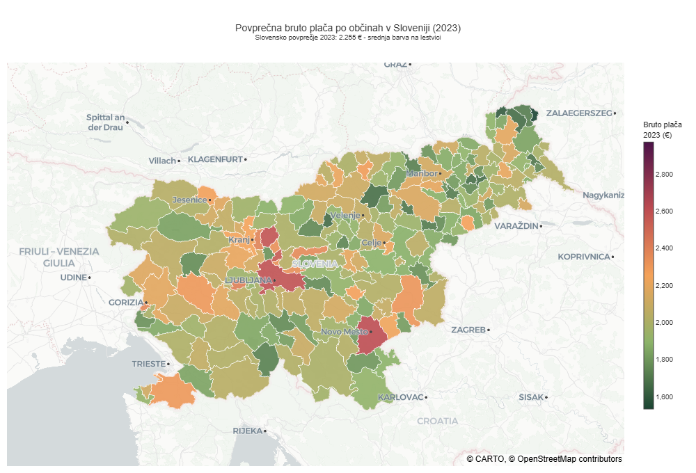
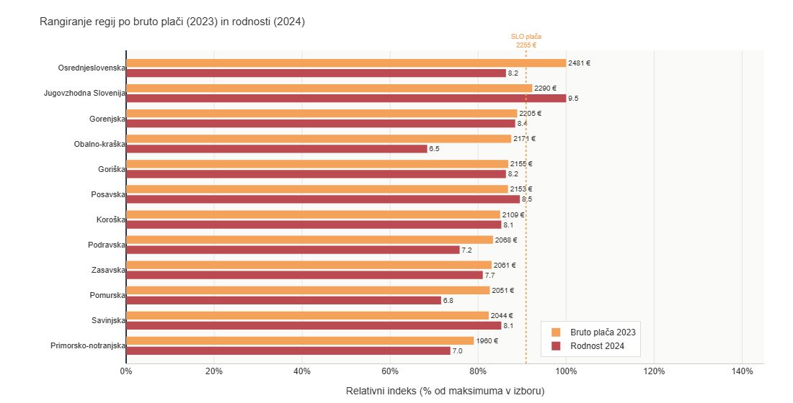
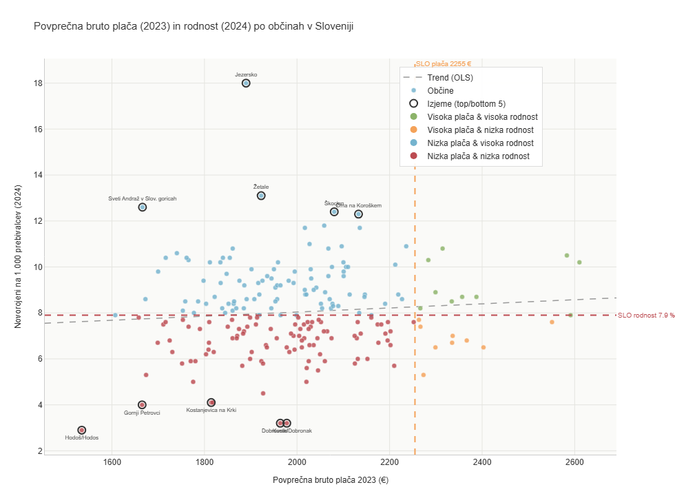
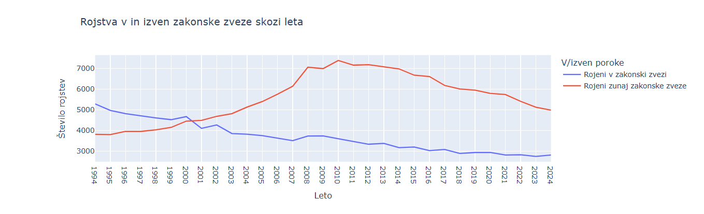
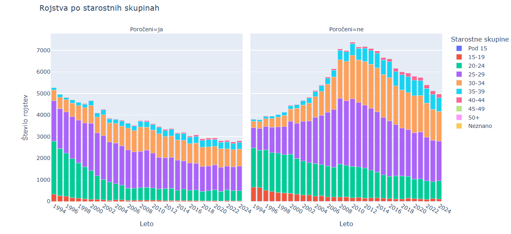

# Vpliv socio-ekonomskih dejavnikov na rodnost v Sloveniji

## 1. Opis problema
V zadnjih letih je bilo veliko govora o upadu rodnosti v Sloveniji. Namen tega projekta je raziskati kateri dejavniki (višina plač, stopnja urbanizacije, stopnja zaposlenosti, dostop do stanovanj, izobrazba ipd.) korelirajo z rodnostjo v državi. 

**Cilj projekta** je raziskati kateri dejavnik ima največji negativen/pozitiven vpliv na rodnost.

## 2. Vprašanja
- Kako plača (povprečna plača, minimalna plača) vpliva na rodnost v posamezni občini ali regiji?
- Koliko je prvih rojstev zunaj/znotraj zakonske zveze?
- Kako stopnja urbanizacije (mesto vs. podeželje) vpliva na število rojstev?
- Ali višja stopnja izobrazbe prebivalstva vpliva na nižjo/višjo rodnost?

## 3. Viri in oblika podatkov
Projekt temelji na odprtih podatkih v obliki tabel na strani SiStat (SURS) 

Za obdelavo podatkov smo uporabili sledeče vire:
- letno število živorojenih (po [regijah](https://pxweb.stat.si/SiStatData/pxweb/sl/Data/-/05J2008S.px) in [občinah](https://pxweb.stat.si/SiStatData/pxweb/sl/Data/-/05J2014S.px))
- Povprečne mesečne plače pri pravnih osebah (po [regijah](https://pxweb.stat.si/SiStatData/pxweb/sl/Data/-/0701023S.px) in [občinah](https://pxweb.stat.si/SiStatData/pxweb/sl/Data/-/0701024S.px))  
- [stopnja izobrazbe matere, ko se otrok rodi](https://pxweb.stat.si/SiStatData/pxweb/sl/Data/Data/05J1027S.px/)
- [živorojeni v zakonski zvezi ali zunaj zakonske zveze](https://pxweb.stat.si/SiStatData/pxweb/sl/Data/Data/05J1018S.px/)

## 4. Analiza podatkov

Za obdelavo in analizo podatkov smo uporabili knjižnico pandas in numpy, za statistično analizo scipy.stats, za vizualizacijo podatkov matplotlib, seaborn in plotly.express, za interaktivne zemljevide folium skupaj z GeoJSON podatki in branca.colormap, ter za delo z besedilnimi podatki in čiščenje nizov re. Za dodatno upravljanje izpisa grafov smo uporabili tudi plotly.io.

### 4.1 Rodnost glede na tip okolja
Iz podatkov o gostoti naseljenosti občin, lahko okvirno določimo kakšen tip naselij tam prevladuje. Za podeželjske občine smo vzeli gostoto do 200 prebivalcev na kvadratni meter, za mesto pa vse kar je več od tega. To smo združili s podatki o številu živorojenih na 1000 prebivalcev posamezne občine.

S tem lahko vidimo, da je rodnost na splošno skozi leta upadala, med letoma 2013-2018 pa se je tudi zgodila ta sprememba, da je rodnost v mestih začela upadati močneje kot na podeželju. Tako je v zadnjih nekaj letih opaziti več rojstev v manjših naseljih, morda zaradi večje prisotnosti tradicionalnih vrednot kot v mestih.

*Slika 1: Povprečna rodnost v obdobju 2007-2023.*

### 4.2 Zemljevid rodnosti po občinah
**Največja rodnost** je opazna predvsem v predmestjih Ljubljane. Lahko bi sklepali, da se mladi selijo na obrobje mesta, oziroma je življenje tam bolj cenovno ugodno, sploh kar se tiče nepremičnin, ki so ključen del za ustvarjanje družine. Lahko pa bi sklepali tudi, da gre za vrednote, močne rdeče lise namreč lahko opazimo tudi na jugovzhodu, ter na območju Gorenja vas - Poljane. To so bolj tradicionalno usmerjena območja, kjer je podeželjski način življenja še vedno močno povezan z velikimi družinami. Nobeno od večjih, moderniziranih mest namreč ni temneje obarvano.

**Nizka rodnost** pa je predvsem na odročnih delih in hribovitih legah, kjer se nahajajo le kakšne samotne kmetije - Bovec in Kranjska Gora sredi Alp, ter na Pohorju Ruše in Podvelka. Prav tako je zeleno-rumeno tudi Prekmurje, kjer je mladih vedno manj.

*Občine, ki so obarvane sivo, so v podatkih v tabelah poimenovane drugače, kot v datoteki interaktivnega zemljevida.*

*Slika 2: Porazdelitev rodnosti po slovenskih občinah.*

Na zemljevidu plač (Slika 3) izrazito izstopata Mestna občina Ljubljana in Novo mesto, ki se barvno uvrščata v najvišji razred. To odraža visoko koncentracijo gospodarskih dejavnosti, javne uprave in močnih industrijskih središč. Podatki potrjujejo proces suburbanizacije. Mladi z višjimi dohodki, ki delajo v Ljubljani, se zaradi visokih cen nepremičnin selijo v obrobne občine, kjer si ustvarijo družino, kar dviguje rodnost v okolici prestolnice, ne pa v njenem središču.

Na obeh zemljevidih močno izstopa regija okoli Novega mesta in proti Ribnici ter Kočevju. Tukaj visoka gospodarska razvitost neposredno pozitivno korelira z demografsko rastjo.

Severovzhodni del Slovenije (Prekmurje, Podravje ob meji) prevladuje v temno zelenih odtenkih, kar nakazuje na občutno nižje povprečne bruto plače. Nizko ekonomsko stanje in pomanjkanje visoko plačanih delovnih mest v teh regijah dolgoročno spodbujata izseljevanje mladih, kar neposredno vodi v nižjo rodnost in hitrejše staranje prebivalstva.

*Slika 3: Povprečne bruto plače po občinah*

Zemljevid mediane cen nepremičnin jasno riše tri "vroča" območja (Ljubljana kot gospodarsko središče, turistična središča na Gorenjskem in na obali). Če pogledamo ta ista območja na zemljevidu rodnosti (za obalo nimamo podatkov), opazimo močan kontrast. Sama Mestna občina Ljubljana in gorenjski turistični centri (Bovec, Kranjska Gora) so obarvani zeleno-rumeno, kar pomeni nizko do podpovprečno rodnost. Izjemno visoke cene nepremičnin mladim parom v teh krajih močno otežujejo reševanje stanovanjskega vprašanja. Ker si težko privoščijo primerno veliko stanovanje za družino, se odločitev za prvega ali naslednjega otroka odloži ali pa se ji odpovejo.

Najbolj neposreden dokaz o vplivu cen vidimo, ko opazujemo prehod iz Ljubljane v njeno okolico. Na zemljevidu cen se z odmikom od Ljubljane barva hitro spremeni iz rdeče v rumeno in svetlo zeleno, predvsem proti Dolenjski. Na zemljevidu rodnosti pa je situacija obratna: okolica Ljubljane in Dolenjska sta oranžno-rdeči. Mladi pari se zaradi visokih cen v mestnem jedru selijo na obrobje, kjer so nepremičnine cenovno dostopnejše. Tam si ustvarijo dom in družino, kar umetno znižuje rodnost v mestih in jo drastično povišuje v predmestjih ter bližnjih podeželskih občinah.

Prekmurje, Koroška in deli Kočevskega na zemljevidu nepremičnin izstopajo z najnižjimi cenami nepremičnin. Kljub poceni stanovanjem pa so ta območja na zemljevidu rodnosti rumeno-zelenkasta. 

**Sklep:** Poceni nepremičnine same po sebi niso dovolj za visoko rodnost, če v regiji ni delovnih mest in ekonomskega razvoja. Mladi se iz teh regij izseljujejo zaradi iskanja zaposlitve, kar povzroča demografski upad kljub ugodnemu stanovanjskemu trgu.

*Slika 4: Mediana cen nepremičnin po občinah*

### 4.3 Vpliv izobrazbe matere na prvo rojstvo

V vseh skupinah je viden splošen padec števila prvih rojstev skozi čas. Najvišje vrednosti povprečno imajo matere z višješolsko ali visokošolsko izobrazbo. Vse izobrazbene skupine imajo negativen naklon trenda, kar pomeni stalno zmanjševanje števila prvih rojstev.

Največji padec ima srednješolska skupina, kar kaže, da se demografske spremembe najbolj poznajo prav v tej populaciji. Najmanjši padec ima osnovnošolska ali nižja izobrazba, vendar je ta skupina numerično najmanjša.

**Sklep**: izobrazba sama po sebi ne povečuje števila rojstev, ampak vpliva predvsem na čas odločanja za prvega otroka (kasnejše materinstvo). Upad prvih rojstev je splošen demografski pojav, ne le posledica izobrazbe.

*Slika 5: Trend prvih rojstev glede na doseženo izobrazbo matere..*

### 4.4 Vpliv starosti matere na prvo rojstvo

Največ prvih rojstev je v starostni skupini **25–29 let**. Sledi skupina **30–34 let**, kar kaže na premik materinstva v kasnejša leta. Starostni skupini pod 20 let in 40+ let imata zelo nizke vrednosti, kar potrjuje, da je zgodnje in pozno materinstvo redko.

**Sklep**: povprečna starost ob prvem rojstvu se premika navzgor (odlašanje materinstva).

*Slika 6: Število prvih rojstev po starostnih skupinah mater glede na leto*

Na podlagi grafa lahko sklepamo, da se v Sloveniji soočamo z upadom števila prvorojencev, kar kaže na to, da se vse manj žensk odloča za prvega otroka. Ta pojav je lahko povezan s kasnejšim odločanjem za materinstvo ter širšimi družbenimi in ekonomskimi dejavniki.

**Sklep**: Slovenija se sooča z dolgoročnim upadom števila prvorojencev.

*Slika 7: Število prvih rojstev letno.*

### 4.5 Vpliv povprečne bruto plače na rodnost

### 4.5.1 Po regijah

Vizualno lahko opazimo, da regije z višjimi plačami (npr. Jugovzhodna Slovenija in Osrednjeslovenska) pogosto izkazujejo tudi višje stopnje rodnosti, medtem ko imajo regije na dnu plačilne lestvice (npr. Pomurska, Obalno-kraška) rodnost pod povprečjem.

**Sklep**: Med povprečno bruto plačo in rodnostjo obstaja zmerna pozitivna korelacija. To pomeni, da z naraščanjem plač v regiji načeloma narašča tudi rodnost. Čeprav je trend opazen, rezultat ni statistično značilen. To je posledica majhnega vzorca (le 12 statističnih regij). Za potrditev trdne vzročne povezave bi potrebovali daljše časovno obdobje ali podrobnejše podatke na ravni občin.

*Slika 8: Primerjava povprečne plače s povprečno rodnostjo glede na regijo.*

#### 4.5.2 Po občinah

V spodnji analizi primerjamo ekonomski razvoj, merjen s povprečno bruto plačo (2023), z demografskim trendom - rodnostjo (živorojeni na 1.000 prebivalcev, 2024) - po vseh slovenskih občinah. Cilj je ugotoviti, ali obstaja sistematična povezava med prihodki in rodnostjo na ravni lokalne skupnosti.

Za razliko od analize po regijah (12 enot) nam analiza na ravni občin ponudi bistveno večji vzorec (~200 občin), kar omogoča zanesljivejše statistične zaključke.

Občine delimo v 4 kvadrante glede na slovensko povprečje plač (2.255 €) in rodnosti (7,9 ‰):

- Visoka plača & visoka rodnost - demografsko in ekonomsko vitalne skupnosti
- Visoka plača & nizka rodnost - ekonomsko razvite, a demografsko šibkejše občine
- Nizka plača & visoka rodnost - živahne ruralne skupnosti kljub nižjim prihodkom
- Nizka plača & nizka rodnost - demografsko in ekonomsko ogrožena območja

Razsevni diagram kaže porazdelitev ~200 občin po dveh dimenzijah. Vsaka točka je ena občina, barva označuje kvadrant glede na slovensko povprečje.

Regresijska premica (siva, prekinjena) nakazuje splošen trend. Izstopajoče vrednosti pri rodnosti pogosto pripadata majhnim občinam (npr. Dobje, Hodoš, Kobilje), kjer že en otrok več ali manj bistveno vpliva na stopnjo na 1.000 prebivalcev - te vrednosti je treba interpretirati previdno.

*Majhne občine (< ~500 preb.) imajo statistično nestabilne stopnje rodnosti in nagnjenost k ekstremnim vrednostim.*

*Slika 9: Primerjava povprečne plače s povprečno rodnostjo glede na občino.*

### 4.6 Prvorojeni v in zunaj zakonske zveze

Da odgovorimo na vprašanje, kako se spreminja število rojstev zunaj in v zakonski zvezi, smo našli podatke, ki predstavljajo le-to. Na žalost takšna statistika obstaja le za prvega rojenega otroka, kar je glede na podatke SURS približno polovica rojenih otrok.

*Slika 10: Količina rojstev v in zunaj zakonske zveze skozi leta.*

**Sklep**: Iz grafa vidimo, da količina rojstev zunaj zakonske zveze zadnjih 30 let le narašča. Okoli leta 2000 lahko opazimo spremembo v grafu, saj rojstva zunaj zakonske zveze postanejo bolj pogosta od rojstev v zakonski zvezi.

Če želimo ugotoviti, katere starostne skupine najbolj vplivajo na to spremembo, moramo pogledati tudi rodnost po starostnih skupinah.

*Slika 11: Števila rojstev v in zunaj zakonske zveze čez leta glede na starostno skupino.*

**Sklep**: Iz grafa vidimo, da število rojstev zunaj zakonske zveze zadnjih 30 let narašča v vseh starostnih skupinah, še posebej v starostnih skupinah pod 30.

## 5. Zaključek

Z analizo obsežnih podatkovnih nizov smo uspeli potrditi, da rodnost ni izoliran demografski pojav, temveč neposreden odziv na ekonomske spodbude, stanovanjsko dostopnost in spremembe v življenjskem slogu prebivalstva.
Skozi raziskavo smo prišli do treh ključnih ugotovitev:

**1. Izseljevanje mladih družin iz urbanih središč:**
Čeprav analiza na ravni regij in uspešnih industrijskih občin (npr. Novo mesto) kaže zmerno pozitivno korelacijo med višjimi bruto plačami in rodnostjo, v največjih ekonomskih središčih naletimo na paradoks. Mestna občina Ljubljana in turistični centri izkazujejo visoke prihodke, a hkrati izrazito nizko rodnost. Razlog za to tiči v kritični nedostopnosti stanovanjskega trga. Ekstremno visoke cene nepremičnin (ki v teh krajih presegajo 3.000 ali celo 4.000 €/$m^2$) delujejo kot glavna zavora za ustvarjanje družine.

**2. Dinamika predmestij:**
Primerjalna analiza zemljevidov jasno razkriva proces suburbanizacije. Mladi pari z višjimi dohodki se zaradi stanovanjskega krča iz mest selijo na obrobja (npr. okolica Ljubljane), kjer so nepremičnine cenovno bolj dostopne, okolje pa manj urbanizirano. Ta selitveni tok umetno niža stopnjo rodnosti v mestih in jo drastično povišuje v sosednjih podeželskih ter predmestnih občinah, kar se sklada z ugotovitvijo, da rodnost v ruralnih okoljih v zadnjem desetletju upada znatno počasneje kot v mestih.

**3. Sprememba družbenih vrednot in odlašanje materinstva:**
Demografski podatki o starosti in izobrazbi mater potrjujejo, da višja stopnja izobrazbe podaljšuje čas študija in vstopa na trg dela, kar neposredno zamika rojstvo prvega otroka v kasnejša leta. Hkrati tektonska sprememba v zadnjih 30 letih, ko so rojstva zunaj zakonske zveze postala večinska, kaže na popolno preobrazbo tradicionalnih družinskih struktur v moderni družbi.

Raziskava kaže, da ima kombinacija dostopnosti stanovanja in geografske lokacije (stopnje urbanizacije) trenutno največji neposredni vpliv na odločitev o ustvarjanju družine. Nizke cene nepremičnin na odročni periferiji (npr. Prekmurje) same po sebi ne zadoščajo za dvig rodnosti, če tam ni ekonomske vitalnosti. Najbolj optimalno okolje za nataliteto v Sloveniji tako predstavljajo občine v "zlati sredini" – to so gospodarsko stabilna območja v zaledju večjih mest, kjer pa cene nepremičnin še niso presegle kritične meje dostopnosti za mlade pare.

Za dolgoročno stabilizacijo demografskega upada v Sloveniji so torej ključni sistemski ukrepi na področju decentralizacije gospodarstva in aktivne stanovanjske politike za mlade.
