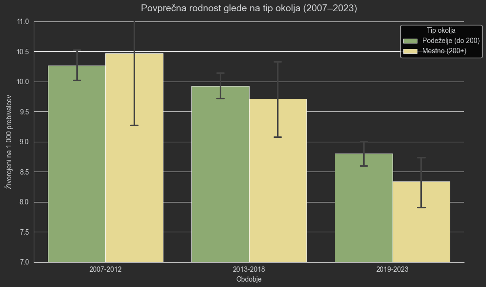
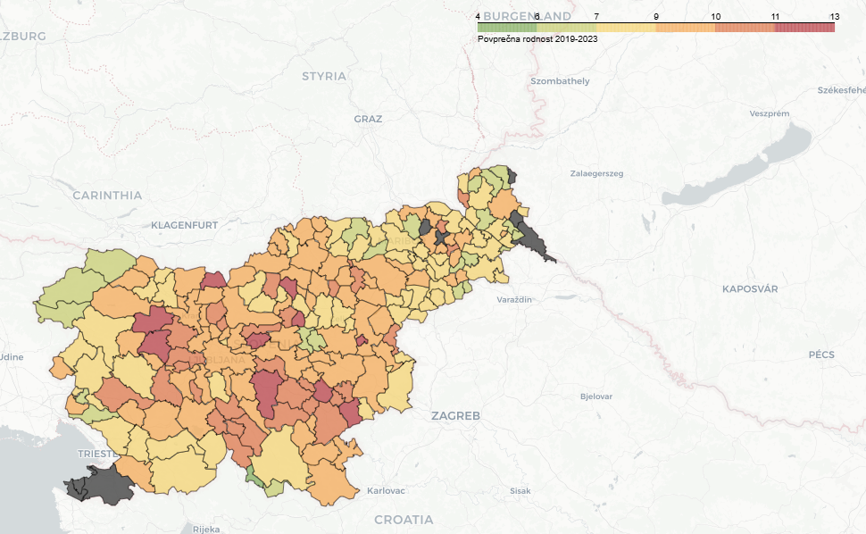
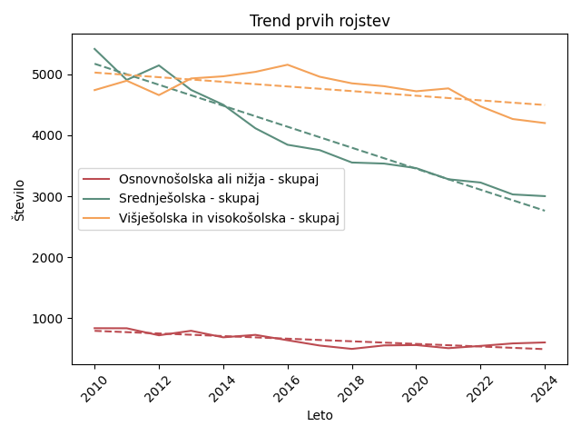
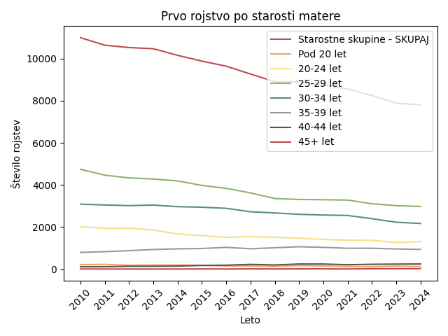
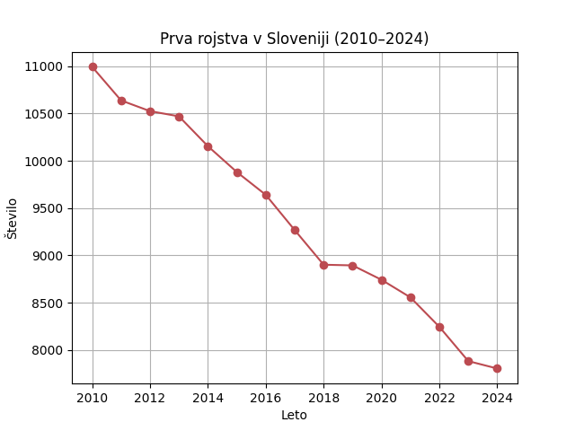
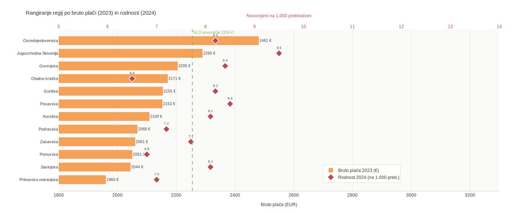

# Vpliv socio-ekonomskih dejavnikov na rodnost v Sloveniji

## Opis problema
V zadnjih letih je bilo veliko govora o upadu rodnosti v Sloveniji. Namen tega projekta je raziskati kateri dejavniki (višina plač, stopnja urbanizacije, stopnja zaposlenosti, dostop do stanovanj, izobrazba ipd.) korelirajo z rodnostjo v državi. 

**Cilj projekta** je raziskati kateri dejavnik ima največji negativen/pozitiven vpliv na rodnost.

## Vprašanja
- Kako plača (povprečna plača, minimalna plača) vpliva na rodnost v posamezni občini ali regiji?
- Ali obstaja povezava med stopnjo zaposlenosti/brezposelnosti in rodnostjo?
- Kako stopnja urbanizacije (mesto vs. podeželje) vpliva na število rojstev?
- Ali višja stopnja izobrazbe prebivalstva vpliva na nižjo/višjo rodnost?

Do vmesnega poročila smo okvirno analizirali podatke zadanih tem in jih grafično prikazali.

## Vir in oblika podatkov
Projekt temelji na odprtih podatkih v obliki tabel na strani SiStat (SURS) 

Za obdelavo podatkov smo uporabili sledeče vire:
- letno število živorojenih (po [regijah](https://pxweb.stat.si/SiStatData/pxweb/sl/Data/-/05J2008S.px) in [občinah](https://pxweb.stat.si/SiStatData/pxweb/sl/Data/-/05J2014S.px))
- Povprečne mesečne plače pri pravnih osebah (po [regijah](https://pxweb.stat.si/SiStatData/pxweb/sl/Data/-/0701023S.px) in [občinah](https://pxweb.stat.si/SiStatData/pxweb/sl/Data/-/0701024S.px))  
- [stopnja zaposlenosti/brezposelnosti](https://pxweb.stat.si/SiStatData/pxweb/sl/Data/Data/2640005S.px/) 
- [stopnja izobrazbe matere, ko se otrok rodi](https://pxweb.stat.si/SiStatData/pxweb/sl/Data/Data/05J1027S.px/)
- [živorojeni v zakonski zvezi ali zunaj zakonske zveze](https://pxweb.stat.si/SiStatData/pxweb/sl/Data/Data/05J1018S.px/)

## Analiza podatkov

### Rodnost glede na tip okolja
Iz podatkov o gostoti naseljenosti občin, lahko okvirno določimo kakšen tip naselij tam prevladuje. Za podeželjske občine smo vzeli gostoto do 200 prebivalcev na kvadratni meter, za mesto pa vse kar je več od tega. To smo združili s podatki o številu živorojenih na 1000 ljudi posamezne občine.

S tem lahko vidimo, da je rodnost na splošno skozi leta upadala, med letoma 2013-2018 pa se je tudi zgodila ta sprememba, da je rodnost v mestih začela upadati močneje kot na podeželju. Tako je v zadnjih nekaj letih veliko več rojstev v manjših naseljih, morda zaradi večje prisotnosti tradicionalnih vrednot kot v mestih.

*Slika 1: Povprečna rodnost v obdobju 2007-2023.*

### Zemljevid rodnosti po občinah
**Največja rodnost** je opazna predvsem v predmestjih Ljubljane. Lahko bi sklepali, da se mladi selijo na obrobje mesta, oziroma je življenje tam bolj cenovno ugodno, sploh kar se tiče nepremičnin, ki so ključen del za ustvarjanje družine. Lahko pa bi sklepali tudi, da gre za vrednote, močne rdeče lise namreč lahko opazimo tudi na jugovzhodu, ter na območju Gorenja vas - Poljane. To so bolj tradicionalno usmerjena območja, kjer je podeželjski način življenja še vedno močno povezan z velikimi družinami. Nobeno od večjih, moderniziranih mest namreč ni temneje obarvano.

**Nizka rodnost** pa je predvsem na odročnih delih in hribovitih legah, kjer se nahajajo le kakšne samotne kmetije - Bovec in Kranjska Gora sredi Alp, ter na Pohorju Ruše in Podvelka. Prav tako je zeleno-rumeno tudi Prekmurje, kjer je mladih vedno manj.

*Občine, ki so obarvane sivo, so v podatkih v tabelah poimenovane drugače, kot v datoteki interaktivnega zemljevida.*

*Slika 2: Porazdelitev rodnosti po slovenskih občinah.*

### Vpliv stopnje izobrazbe matere in starosti na prvo rojstvo

# rojstva po izobrazbi

V vseh skupinah je viden splošen padec števila prvih rojstev skozi čas.
Najvišje vrednosti povprečno imajo matere s **višješolsko/visokošolsko izobrazbo**.
Vse izobrazbene skupine imajo negativen naklon trenda, kar pomeni stalno zmanjševanje števila prvih rojstev.
Največji padec ima srednješolska skupina, kar kaže, da se demografske spremembe najbolj poznajo prav v tej populaciji.
Najmanjši padec ima osnovnošolska ali nižja izobrazba, vendar je ta skupina numerično najmanjša.

**Sklep**: izobrazba sama po sebi ne povečuje števila rojstev, ampak vpliva predvsem na čas odločanja za prvega otroka (kasnejše materinstvo). Upad prvih rojstev je splošen demografski pojav, ne le posledica izobrazbe.

*Slika 3: Trend rojstev.*

# Analiza po starosti

Največ prvih rojstev je v starostni skupini 25–29 let. Sledi skupina 30–34 let, kar kaže na premik materinstva v kasnejša leta.
Starostni skupini pod 20 let in 40+ let imata zelo nizke vrednosti, kar potrjuje, da je zgodnje in pozno materinstvo redko.

**Sklep**: povprečna starost ob prvem rojstvu se premika navzgor (odlašanje materinstva).

*Slika 4: Število prvih rojstev po starostnih skupinah mater glede na leto*

Na podlagi grafa lahko sklepamo, da se v Sloveniji soočamo z upadom števila prvorojencev, kar kaže na to, da se vse manj žensk odloča za prvega otroka. Ta pojav je lahko povezan s kasnejšim odločanjem za materinstvo ter širšimi družbenimi in ekonomskimi dejavniki.

**Sklep**: Slovenija se sooča z dolgoročnim upadom števila prvorojencev.

*Slika 5: Število prvih rojstev letno.*

### Vpliv povprečne bruto plače na rodnost po regijah

Vizualno lahko opazimo, da regije z višjimi plačami (npr. Jugovzhodna Slovenija in Osrednjeslovenska) pogosto izkazujejo tudi višje stopnje rodnosti, medtem ko imajo regije na dnu plačilne lestvice (npr. Pomurska, Obalno-kraška) rodnost pod povprečjem.

**Sklep**: Med povprečno bruto plačo in rodnostjo obstaja zmerna pozitivna korelacija. To pomeni, da z naraščanjem plač v regiji načeloma narašča tudi rodnost. Čeprav je trend opazen, rezultat ni statistično značilen. To je posledica majhnega vzorca (le 12 statističnih regij). Za potrditev trdne vzročne povezave bi potrebovali daljše časovno obdobje ali podrobnejše podatke na ravni občin.

*Slika 6: Primerjava povprečne plače s povprečno rodnostjo.*